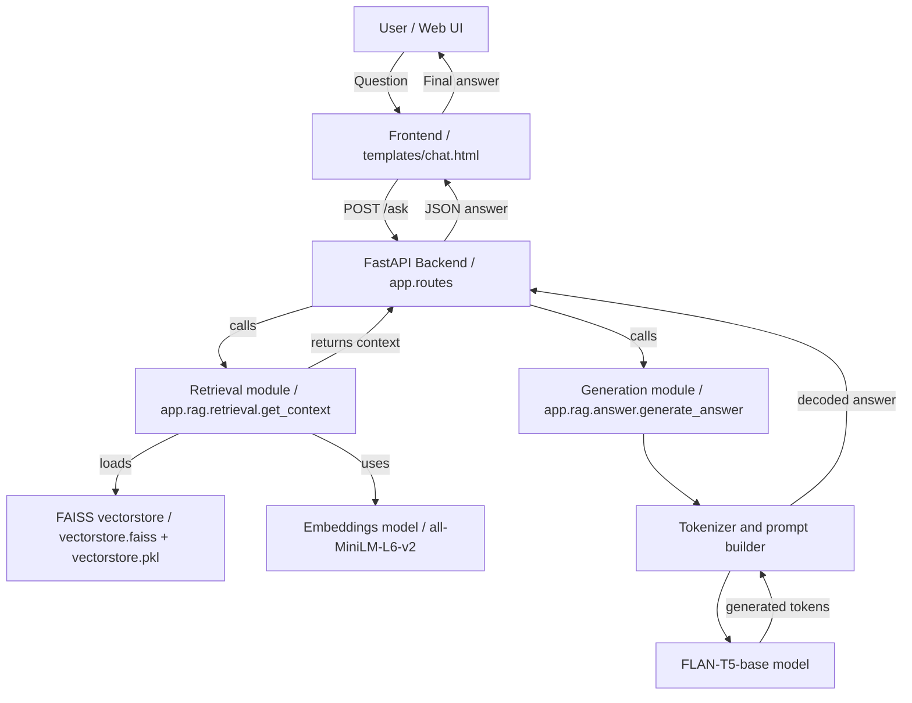

# System Architecture

This diagram shows how the Policy‑RAG‑App processes user questions using Retrieval‑Augmented Generation.

```mermaid
flowchart TD
    U[User / Web UI] -->|Question| FE[Frontend / templates/chat.html]
    FE -->|POST /ask| API[FastAPI Backend / app.routes]
    API -->|calls| RET[Retrieval module / app.rag.retrieval.get_context]
    RET -->|loads| VS[FAISS vectorstore / vectorstore.faiss + vectorstore.pkl]
    RET -->|uses| EMB[Embeddings model / all-MiniLM-L6-v2]
    RET -->|returns context| API
    API -->|calls| GEN[Generation module / app.rag.answer.generate_answer]
    GEN --> TOK[Tokenizer and prompt builder]
    TOK --> MODEL[FLAN-T5-base model]
    MODEL -->|generated tokens| TOK
    TOK -->|decoded answer| API
    API -->|JSON answer| FE
    FE -->|Final answer| U
```